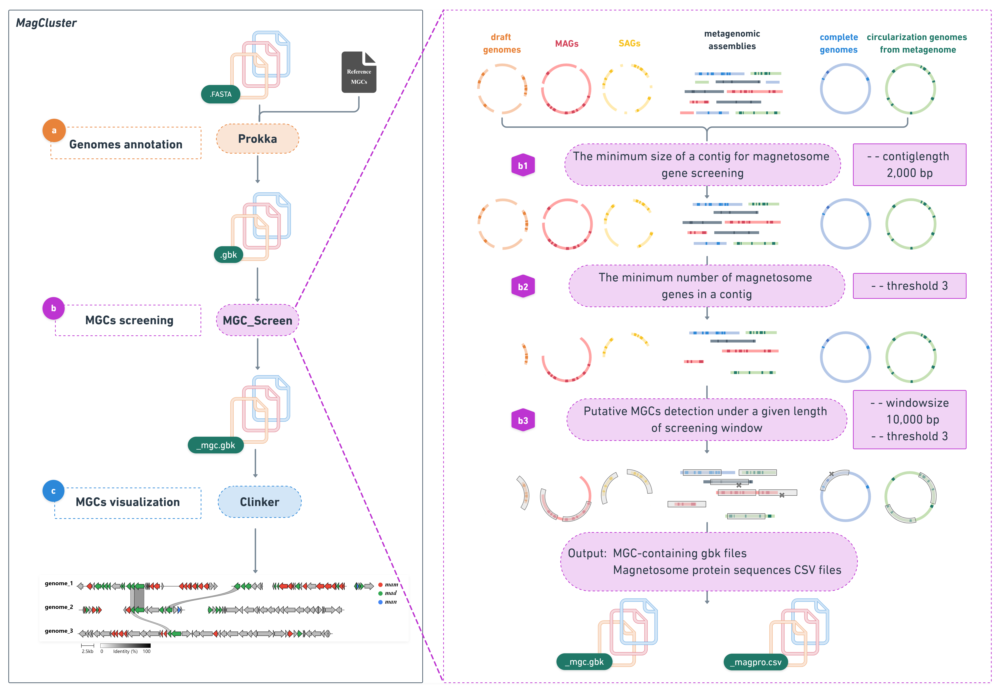
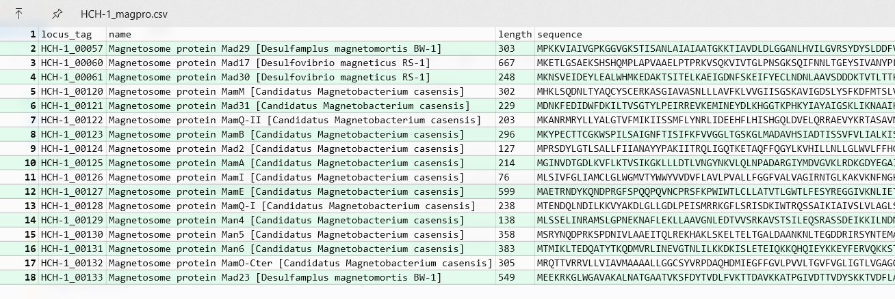
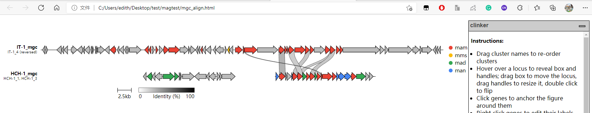

# MagCluster
[](https://anaconda.org/bioconda/magcluster) [](https://anaconda.org/bioconda/magcluster) [](https://anaconda.org/bioconda/magcluster) [](https://conda.anaconda.org/bioconda) [](https://anaconda.org/bioconda/magcluster) 

MagCluster is a tool for identification, annotation and visualization of magnetosome gene clusters (MGCs) from genomes of magnetotactic bacteria (MTB). MagCluster leverages the physical cluster property of magnetosome genes on the chromosome to identify MGCs, which are otherwise difficult to accurately identify based solely on sequence identity.


**MagCluster workflow schematic** (a) Genomes are annotated using Prokka with a mandatory reference file of magnetosome proteins database via --proteins. (b) Putative MGC-containing contigs are retrieved by MGC_Screen module from GenBank files: (b1) contigs shorter than 2000 bp (by default) are discarded; (b2) magnetosome genes are identified through a text-mining strategy using the keyword ‘magnetosome’ in protein names, and contigs containing less than 3 (by default) magnetosome genes are discarded; (b3) putative MGCs are screened under a 10,000-bp (by default) window, and the minimum number of magnetosome genes (3 by default) in each window size is re-checked. (c) Putative MGCs are aligned and visualized using Clinker.

## Contents
- [Installation](#installation)
  - [Conda](#conda)
  - [Bioconda](#bioconda)
  - [Pip](#pip)
- [Usage](#usage)
  - [Genomes annotation](#genomes-annotation)
  - [MGCs screening](#MGCs-screening)
  - [MGCs alignment and visualization](#MGCs-alignment-and-visualization)
- [Tutorials](#tutorials)
- [Citation](#Citation)
- [Contact us](#contact-us)
---

## Installation
**MagCluster has been checked by bioconda on Linux and MacOS. It is currently not supported on Windows, try [WSL](https://docs.microsoft.com/en-us/windows/wsl/install-win10) instead if you are using Win10.**
### Conda
MagCluster can be installed through [Conda](https://www.anaconda.com/products/individual). We recommend creating a ***new environment*** for MagCluster to avoid dependency conflicts.

```bash
# Download yml file
wget https://github.com/RunJiaJi/magcluster/releases/download/0.2.0/magcluster-0.2.0.yml

# Install MagCluster
conda env create -n magcluster --file magcluster-0.2.0.yml

# Optional cleanup
rm magcluster-0.2.0.yml

# Activate magcluster environment
conda activate magcluster

# Check for the usage of MagCluster
magcluster -h
```
### Bioconda
```bash
# Create magcluster environment
conda create -n magcluster

# Activate magcluster environment
conda activate magcluster

# Install MagCluster through bioconda channel
conda install -c conda-forge -c bioconda -c defaults blast=2.9 prokka=1.13.4 magcluster=0.2.0

# Check for the usage of MagCluster
magcluster -h
```
### Pip
Alternatively, you can install MagCluster through pip in an existing environment. In this way, please make sure you have [Prokka](https://github.com/tseemann/prokka) installed.

```bash
# Install MagCluster through pip
pip install magcluster

# Check for the usage of MagCluster
magcluster -h
```

## Usage


MagCluster comprises three modules for MGCs batch processing: 
(i) genomes annotation with [Prokka](https://github.com/tseemann/prokka)
(ii) MGCs screening with MGC_Screen
(iii) MGCs visualization with [Clinker](https://github.com/gamcil/clinker)


```bash
usage: magcluster [options]

Options:
  {prokka,mgc_screen,clinker}
    prokka              Genome annotation with Prokka
    mgc_screen          Magnetosome gene cluster screening with MGC_Screen
    clinker             Magnetosome gene cluster visualization with Clinker
```
#### Genomes annotation
 **Multiple genome files** (.fasta/.fna/.fa/.FASTA) or **genome-containing folder(s)** are accepted as input for batch annotation. The general usage is the same as Prokka, but some parameters are set with default values for genomes batch annotation.

To avoid confusion, the name of each genome is used as the output folder’s name (`--outdir GENOME_NAME`), output files’ prefix (`--prefix GENOME_NAME`), and GenBank file’s locus_tag (`--locustag GENOME_NAME`) by default. The `--compliant` parameter is also used by default to ensure standard GenBank files. 

 For MGCs annotation, MagCluster requires a [mandatory file](https://github.com/RunJiaJi/magcluster/releases/download/v1.0/Magnetosome_protein_data.fasta.faa) containing magnetosome protein sequences from representative MTB strains, which is attached to MagCluster and used by default.
The value of `--evalue` is recommended to set to 1e-05.
```bash
example usage: 

# MGCs annotation with multiple MTB genomes as input
$ magcluster prokka --evalue 1e-05 MTB_genome1.fasta MTB_genome2.fasta MTB_genome3.fasta

# MGCs annotation with MTB genomes containing folder as input
$ magcluster prokka --evalue 1e-05 ./MTB_genomes_folder
```

#### MGCs screening
MGC_Screen module retrieves MGC-containing contigs/scaffolds in GenBank files.

 As magnetosome genes are always physically clustered together in MTB genomes, MGC_Screen uses ‘magnetosome’ as the keyword searching for product names in GenBank files generated by above Prokka module and identifies putative MGCs based on the existence of multiple magnetosome genes in a given contig and a given length of screening window.

Three parameters involved in MGCs screening, `--contiglength`, `--windowsize` and `--threshold` (see below). You can adjust them according to needs. 

For each genome, MGC_Screen produces two files as output: a *GenBank file of putative MGCs containing contigs* and a *csv file summarizing all putative magnetosome protein sequences*.
```bash

usage: magcluster mgc_screen [-h] [-l CONTIGLENGTH] [-win WINDOWSIZE] [-th THRESHOLD] [-o OUTDIR] gbkfile [gbkfile ...]

positional arguments:
  gbkfile               .gbk/.gbf files to analyzed. Multiple files or files-containing folder is acceptable.

optional arguments:
  -h, --help            show this help message and exit
  -l CONTIGLENGTH, --contiglength CONTIGLENGTH
                        The minimum length of contigs to be considered (default '2,000 bp')
  -w WINDOWSIZE, --windowsize WINDOWSIZE
                        The length of MGCs screening window (default '10,000 bp')
  -th THRESHOLD, --threshold THRESHOLD
                        The minimum number of magnetosome genes in a given contig and a given length of screening window (default '3')
  -o OUTDIR, --outdir OUTDIR
                        Output folder (default 'mgc_screen')
```
```bash
example usage: 

# MGCs screening with multiple GenBank files as input
$ magcluster mgc_screen --threshold 3 --contiglength 2000 --windowsize 10000 file1.gbk file2.gbk file3.gbk

# MGCs screening with GenBank files containing folder as input
$ magcluster mgc_screen --threshold 3 --contiglength 2000 --windowsize 10000 ./gbkfiles_folder
```

#### MGCs alignment and visualization
We use [Clinker](https://github.com/gamcil/clinker) for MGCs alignment and visualization. Note that the `-p` parameter is used by default to generate an interactive HTML web page where you can modify the MGCs figure and export it as a publication-quality file.

```bash
example usage: 

# MGCs screening with multiple GenBank files as input
$ magcluster clinker -p MGC_align.html ./MGCs_files_folder/*.gbk
```
**Attention: Although MagCluster is efficient, we strongly recommend that putative MGCs identified by MagCluster must be manually checked.**

# Tutorials
This is a simple example to help you quickly start MagCluster journey. We use the genomes of ***Candidatus* Magnetominusculus xianensis strain HCH-1** ([see the paper](https://www.pnas.org/content/pnas/114/9/2171.full.pdf)) and ***Magnetofaba australis* IT-1** ([see the paper](https://www.frontiersin.org/articles/10.3389/fmicb.2014.00072/full)) to show how it works.
## Step 0: Prepare MagCluster
To start your journey, make sure you have a working MagCluster in your system.

For installation informations, please check [Installation](#installation).

<font size=2 color="red">In [1]:</font>

```bash
# Activate magcluster environment
conda activate magcluster
# Check MagCluster version
magcluster -v
```
<font size=2 color="red">Out:</font>

    magcluster 0.2.0

     


## Step 1: Obtain data
You can download genome data from NCBI.
- HCH-1 [LNQR00000000](https://www.ncbi.nlm.nih.gov/Traces/wgs/LNQR01?display=download)
- IT-1 [LVJN00000000](https://www.ncbi.nlm.nih.gov/Traces/wgs/LVJN01?display=download)

<font size=2 color="red">In [2]:</font>

```bash
# Make a new folder
mkdir magtest
# Open magtest folder
cd magtest
```

     


<font size=2 color="red">In [3]:</font>

```bash
# Download genomes from NCBI
wget https://sra-download.ncbi.nlm.nih.gov/traces/wgs03/wgs_aux/LN/QR/LNQR01/LNQR01.1.fsa_nt.gz
wget https://sra-download.ncbi.nlm.nih.gov/traces/wgs03/wgs_aux/LV/JN/LVJN01/LVJN01.1.fsa_nt.gz
```

<font size=2 color="red">Out:</font>

    Will not apply HSTS. The HSTS database must be a regular and non-world-writable file.
    --2021-09-12 22:21:45--  https://sra-download.ncbi.nlm.nih.gov/traces/wgs03/wgs_aux/LN/QR/LNQR01/LNQR01.1.fsa_nt.gz
    Resolving sra-download.ncbi.nlm.nih.gov (sra-download.ncbi.nlm.nih.gov)... 130.14.250.25, 130.14.250.24, 130.14.250.27
    Connecting to sra-download.ncbi.nlm.nih.gov (sra-download.ncbi.nlm.nih.gov)|130.14.250.25|:443... connected.
    HTTP request sent, awaiting response... 200 OK
    Length: 1119868 (1.1M) [application/octet-stream]
    Saving to: ‘LNQR01.1.fsa_nt.gz’
    
    LNQR01.1.fsa_nt.gz  100%[===================>]   1.07M   742KB/s    in 1.5s    
    
    2021-09-12 22:21:48 (742 KB/s) - ‘LNQR01.1.fsa_nt.gz’ saved [1119868/1119868]
    
    Will not apply HSTS. The HSTS database must be a regular and non-world-writable file.
    --2021-09-12 22:21:48--  https://sra-download.ncbi.nlm.nih.gov/traces/wgs03/wgs_aux/LV/JN/LVJN01/LVJN01.1.fsa_nt.gz
    Resolving sra-download.ncbi.nlm.nih.gov (sra-download.ncbi.nlm.nih.gov)... 165.112.9.235, 165.112.9.231, 165.112.9.232
    Connecting to sra-download.ncbi.nlm.nih.gov (sra-download.ncbi.nlm.nih.gov)|165.112.9.235|:443... connected.
    HTTP request sent, awaiting response... 200 OK
    Length: 1516495 (1.4M) [application/octet-stream]
    Saving to: ‘LVJN01.1.fsa_nt.gz’
    
    LVJN01.1.fsa_nt.gz  100%[===================>]   1.45M   370KB/s    in 4.0s    
    
    2021-09-12 22:21:53 (370 KB/s) - ‘LVJN01.1.fsa_nt.gz’ saved [1516495/1516495]
    
     

<font size=2 color="red">In [4]:</font>


```bash
# Check the genome files
ls
```
<font size=2 color="red">Out:</font>

    LNQR01.1.fsa_nt.gz LVJN01.1.fsa_nt.gz
     

<font size=2 color="red">In [5]:</font>


```bash
# Unzip files
gunzip *.gz
ls
```
<font size=2 color="red">Out:</font>

    LNQR01.1.fsa_nt LVJN01.1.fsa_nt
     


<font size=2 color="red">In [6]:</font>

```bash
# Rename the genomes
mv LNQR01.1.fsa_nt HCH-1.fasta
mv LVJN01.1.fsa_nt IT-1.fasta
ls
```
<font size=2 color="red">Out:</font>

    HCH-1.fasta IT-1.fasta
     


## Step 2: Genomes annotation
We recommand the `evalue` to be set as 1e-05. Note that the `--outdir`, `--prefix`, `--locustag` and `--compliant` parameters are used by default. The reference MGCs file that we provide is also used with `--proteins`.

This step should take a while and you can check the log file for details.

<font size=2 color="red">In [7]:</font>

```bash
magcluster prokka --evalue 1e-05 ./*.fasta 
```

    
     


<font size=2 color="red">In [8]:</font>

```bash
# Move `.gbk` files to a new folder
mkdir gbkfolder
mv -v */*.gbk gbkfolder/
```
<font size=2 color="red">Out:</font>

    renamed 'HCH-1_annotation/HCH-1.gbk' -> 'gbkfolder/HCH-1.gbk'
    renamed 'IT-1_annotation/IT-1.gbk' -> 'gbkfolder/IT-1.gbk'
     


## Step 3: MGCs screening
Now that we have `HCH-1.gbk` and `IT-1.gbk`, let's start MGCs screening!

<font size=2 color="red">In [9]:</font>

```bash
magcluster mgc_screen gbkfolder -o mgcfolder
```
<font size=2 color="red">Out:</font>

    [22:30:40] INFO - Starting mgc_screen...
    [22:30:40] INFO - Your file is HCH-1.gbk
    [22:30:40] INFO - The minimum length of contigs to be considered is 2000
    [22:30:40] INFO - The window size for MGCs screening is 10000
    [22:30:40] INFO - The threshold of magnetosome genes in a given contig and a given length of screening window is 3
    [22:30:40] INFO - The output directory is /mnt/c/Users/edith/Desktop/test/magtest/mgcfolder/
    [22:30:40] INFO - Opening your file...
    [22:30:40] INFO - Starting magnetosome genes screening...
    [22:30:40] INFO - Magnetosome gene cluster containing contigs screening completed!
    [22:30:40] INFO - Creating output folder: /mnt/c/Users/edith/Desktop/test/magtest/mgcfolder/
    [22:30:40] INFO - Writing mgc.gbk file...
    [22:30:40] INFO - Writing magpro.csv file(s)...
    [22:30:40] INFO - Starting mgc_screen...
    [22:30:40] INFO - Your file is IT-1.gbk
    [22:30:40] INFO - The minimum length of contigs to be considered is 2000
    [22:30:40] INFO - The maxmum length of contigs to be considered is 10000
    [22:30:40] INFO - The threshold of magnetosome genes in one contig is 3
    [22:30:40] INFO - The output directory is /mnt/c/Users/edith/Desktop/test/magtest/mgcfolder/
    [22:30:40] INFO - Opening your file...
    [22:30:40] INFO - Starting magnetosome genes screening...
    [22:30:41] INFO - Magnetosome gene cluster containing contigs screening completed!
    [22:30:41] INFO - /mnt/c/Users/edith/Desktop/test/magtest/mgcfolder/ folder already exists! Skip to next step
    [22:30:41] INFO - Writing mgc.gbk file...
    [22:30:41] INFO - Writing magpro.csv file(s)...
    [22:30:41] INFO - Done! Thank you!
     


<font size=2 color="red">In [10]:</font>

```bash
ls mgcfolder
```
<font size=2 color="red">Out:</font>

    HCH-1_magpro.csv HCH-1_mgc.gbk IT-1_magpro.csv IT-1_mgc.gbk
     


Good job! Now you can open the `.csv` files to check the magnetosome protein sequences.


## Step 4: MGCs visualization
Final step! We are almost there! 

Use Clinker to generate a MGCs figure. We recommand to use the `-o` parameter to generate a MGCs alignment file where you can browse the homologous gene similarities among genomes.

Be Careful! If there is complete genome(s) in your dataset, the alignment process will take unreasonable time. In that case, we recommand you skip the alignment process with `-na` (no alignment) parameter.

<font size=2 color="red">In [11]:</font>

```bash
magcluster clinker -o mgc_align.txt -p mgc_align.html mgcfolder/*.gbk
```
<font size=2 color="red">Out:</font>

    [22:31:00] INFO - Starting clinker
    [22:31:00] INFO - Parsing files:
    [22:31:00] INFO -   HCH-1_mgc.gbk
    [22:31:00] INFO -   IT-1_mgc.gbk
    [22:31:00] INFO - Starting cluster alignments
    [22:31:00] INFO - HCH-1_mgc vs IT-1_mgc
    [22:31:16] INFO - Generating results summary...
    [22:31:16] INFO - Writing alignments to: mgc_align.txt
    [22:31:16] INFO - Building clustermap.js visualisation
    [22:31:16] INFO - Writing to: mgc_align.html
    [22:31:17] INFO - Done!


Congratulations! Now you should have an interactive html opened in your browser. You can adjust the figure as you like and export it as a `.svg` file.



## Citation
The manuscript is in preparation.

## Contact us
If you have any questions or suggestions, feel free to contact us.

jirunjia@gmail.com or weilin@mail.iggcas.ac.cn
