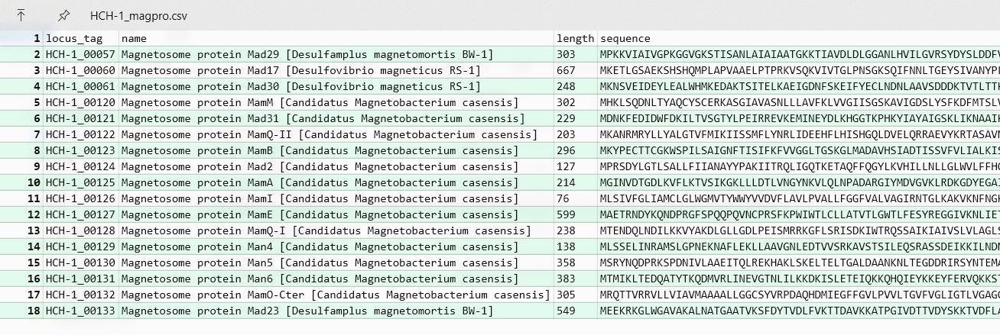

# Tutorials
This is a simple example to help you quickly start MagCluster journey. We use the genome of ***Candidatus* Magnetominusculus xianensis strain HCH-1** to show how it works. Candidatus Magnetominusculus xianensis strain HCH-1 is a metagenomic assembled genome ([see the paper](https://www.pnas.org/content/114/9/2171#:~:text=However%2C%20the%20origin%20of%20magnetotactic%20behavior%20remains%20a,the%20earliest%20magnetic-sensing%20and%20biomineralizing%20organisms%20on%20Earth.)) which we will refer to as HCH-1 in this tutorial. 
## Step 1: Obtaining data
You can download genome data from NCBI.
- HCH-1 [LNQR00000000](https://www.ncbi.nlm.nih.gov/Traces/wgs/LNQR01?display=contigs)
- IT-1 [LVJN00000000](https://www.ncbi.nlm.nih.gov/Traces/wgs/LVJN01?display=contigs)


```bash
# check MagCluster version
conda activate magcluster
magcluster -v
```

    magcluster 0.1.8


```bash
# Make a new folder
mkdir magtest
# Open magtest folder
cd magtest
```


```bash
# Download genomes from NCBI
wget https://sra-download.ncbi.nlm.nih.gov/traces/wgs03/wgs_aux/LN/QR/LNQR01/LNQR01.1.fsa_nt.gz
wget https://sra-download.ncbi.nlm.nih.gov/traces/wgs03/wgs_aux/LV/JN/LVJN01/LVJN01.1.fsa_nt.gz
```

    Will not apply HSTS. The HSTS database must be a regular and non-world-writable file.
    ERROR: could not open HSTS store at '/home/edith/.wget-hsts'. HSTS will be disabled.
    --2021-09-12 22:21:45--  https://sra-download.ncbi.nlm.nih.gov/traces/wgs03/wgs_aux/LN/QR/LNQR01/LNQR01.1.fsa_nt.gz
    Resolving sra-download.ncbi.nlm.nih.gov (sra-download.ncbi.nlm.nih.gov)... 130.14.250.25, 130.14.250.24, 130.14.250.27
    Connecting to sra-download.ncbi.nlm.nih.gov (sra-download.ncbi.nlm.nih.gov)|130.14.250.25|:443... connected.
    HTTP request sent, awaiting response... 200 OK
    Length: 1119868 (1.1M) [application/octet-stream]
    Saving to: ‘LNQR01.1.fsa_nt.gz’
    
    LNQR01.1.fsa_nt.gz  100%[===================>]   1.07M   742KB/s    in 1.5s    
    
    2021-09-12 22:21:48 (742 KB/s) - ‘LNQR01.1.fsa_nt.gz’ saved [1119868/1119868]
    
    Will not apply HSTS. The HSTS database must be a regular and non-world-writable file.
    ERROR: could not open HSTS store at '/home/edith/.wget-hsts'. HSTS will be disabled.
    --2021-09-12 22:21:48--  https://sra-download.ncbi.nlm.nih.gov/traces/wgs03/wgs_aux/LV/JN/LVJN01/LVJN01.1.fsa_nt.gz
    Resolving sra-download.ncbi.nlm.nih.gov (sra-download.ncbi.nlm.nih.gov)... 165.112.9.235, 165.112.9.231, 165.112.9.232
    Connecting to sra-download.ncbi.nlm.nih.gov (sra-download.ncbi.nlm.nih.gov)|165.112.9.235|:443... connected.
    HTTP request sent, awaiting response... 200 OK
    Length: 1516495 (1.4M) [application/octet-stream]
    Saving to: ‘LVJN01.1.fsa_nt.gz’
    
    LVJN01.1.fsa_nt.gz  100%[===================>]   1.45M   370KB/s    in 4.0s    
    
    2021-09-12 22:21:53 (370 KB/s) - ‘LVJN01.1.fsa_nt.gz’ saved [1516495/1516495]
    
      


```bash
# Check the genomes
ls
```

    LNQR01.1.fsa_nt.gz LVJN01.1.fsa_nt.gz


```bash
# Unzip files
gunzip *.gz
ls
```

    LNQR01.1.fsa_nt LVJN01.1.fsa_nt
      


```bash
# Rename the genomes
mv LNQR01.1.fsa_nt HCH-1.fasta
mv LVJN01.1.fsa_nt IT-1.fasta
ls
```

    HCH-1.fasta IT-1.fasta
      


## Step 2: Genome annotation
We recommand the `evalue` to be set as 1e-05. Note that the `--outdir`, `--prefix`, `--locustag` and `--compliant` parameters are used by default. The reference MGCs file that we provide is also used with `--proteins`.

This step should take a while and you can check the log file for details.


```bash
magcluster prokka --evalue 1e-05 . 
```

      


```bash
# Move `.gbk` files to a new folder
mkdir gbkfolder
mv -v */*.gbk gbkfolder/
```

    renamed 'HCH-1_annotation/HCH-1.gbk' -> 'gbkfolder/HCH-1.gbk'
    renamed 'IT-1_annotation/IT-1.gbk' -> 'gbkfolder/IT-1.gbk'
      


## Step 3: MGCs screening
Now that we have `HCH-1.gbk` and `IT-1.gbk`, let's start MGCs screening!


```bash
magcluster mgc_screen gbkfolder -o mgcfolder
```

    [22:30:40] INFO - Starting mgc_screen...
    [22:30:40] INFO - Your file is HCH-1.gbk
    [22:30:40] INFO - The minimum length of contigs to be considered is 2000
    [22:30:40] INFO - The maxmum length of contigs to be considered is 10000
    [22:30:40] INFO - The threshold of magnetosome genes in one contig is 3
    [22:30:40] INFO - The output directory is /mnt/c/Users/edith/Desktop/test/magtest/mgcfolder/
    [22:30:40] INFO - Opening your file...
    [22:30:40] INFO - Starting magnetosome genes screening...
    [22:30:40] INFO - Magnetosome gene cluster containing contigs screening completed!
    [22:30:40] INFO - Creating output folder: /mnt/c/Users/edith/Desktop/test/magtest/mgcfolder/
    [22:30:40] INFO - Writing mgc.gbk file...
    [22:30:40] INFO - Writing magpro.csv file(s)...
    [22:30:40] INFO - Starting mgc_screen...
    [22:30:40] INFO - Your file is IT-1.gbk
    [22:30:40] INFO - The minimum length of contigs to be considered is 2000
    [22:30:40] INFO - The maxmum length of contigs to be considered is 10000
    [22:30:40] INFO - The threshold of magnetosome genes in one contig is 3
    [22:30:40] INFO - The output directory is /mnt/c/Users/edith/Desktop/test/magtest/mgcfolder/
    [22:30:40] INFO - Opening your file...
    [22:30:40] INFO - Starting magnetosome genes screening...
    [22:30:41] INFO - Magnetosome gene cluster containing contigs screening completed!
    [22:30:41] INFO - /mnt/c/Users/edith/Desktop/test/magtest/mgcfolder/ folder already exists! Skip to next step
    [22:30:41] INFO - Writing mgc.gbk file...
    [22:30:41] INFO - Writing magpro.csv file(s)...
    [22:30:41] INFO - Done! Thank you!
      


```bash
ls mgcfolder
```

    HCH-1_magpro.csv HCH-1_mgc.gbk IT-1_magpro.csv IT-1_mgc.gbk
      


Good job! Now you can open the `.csv` files to check the magnetosome protein sequences.


## Step 3: MGCs visualization
Final step! We are almost there! 

Use Clinker to generate a MGCs figure. We recommand to use the `-o` parameter to generate a MGCs alignment file where you can browse the homologous gene similarities among genomes.

Be Careful! If there is complete genome(s) in your dataset, the alignment process will take unreasonable time. In that case, we recommand you skip the alignment process with `-na` (no alignment) parameter.


```bash
magcluster clinker -o mgc_align.txt -p mgc_align.html mgcfolder/*.gbk
```

    [22:31:00] INFO - Starting clinker
    [22:31:00] INFO - Parsing files:
    [22:31:00] INFO -   HCH-1_mgc.gbk
    [22:31:00] INFO -   IT-1_mgc.gbk
    [22:31:00] INFO - Starting cluster alignments
    [22:31:00] INFO - HCH-1_mgc vs IT-1_mgc
    [22:31:16] INFO - Generating results summary...
    [22:31:16] INFO - Writing alignments to: mgc_align.txt
    [22:31:16] INFO - Building clustermap.js visualisation
    [22:31:16] INFO - Writing to: mgc_align.html


Congratulations! Now you should have an interactive html opened in your browser. You can adjust the figure as you like and export it as a `.svg` file.


